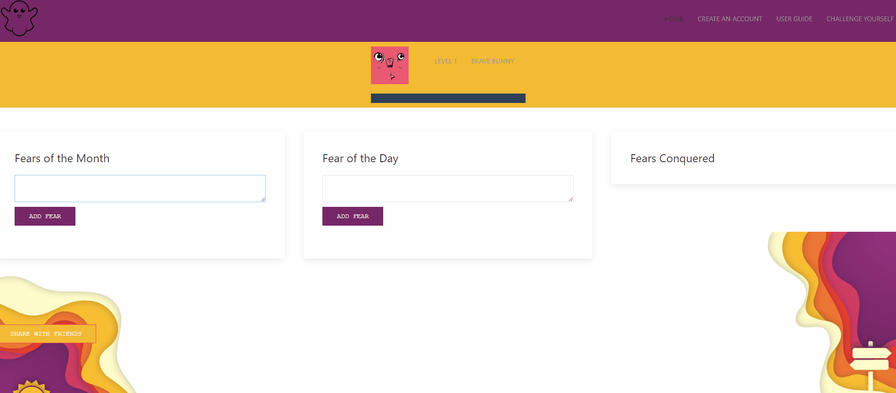
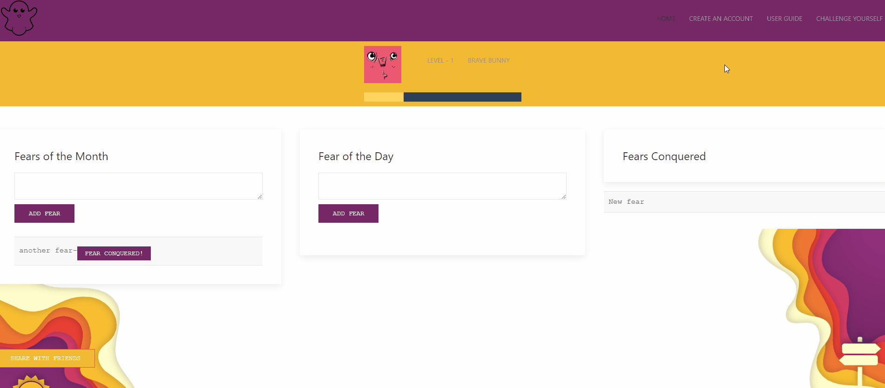
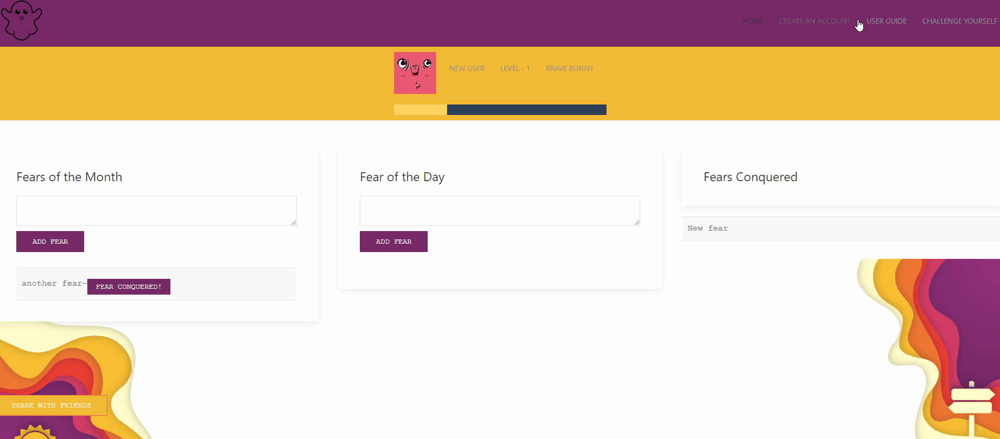
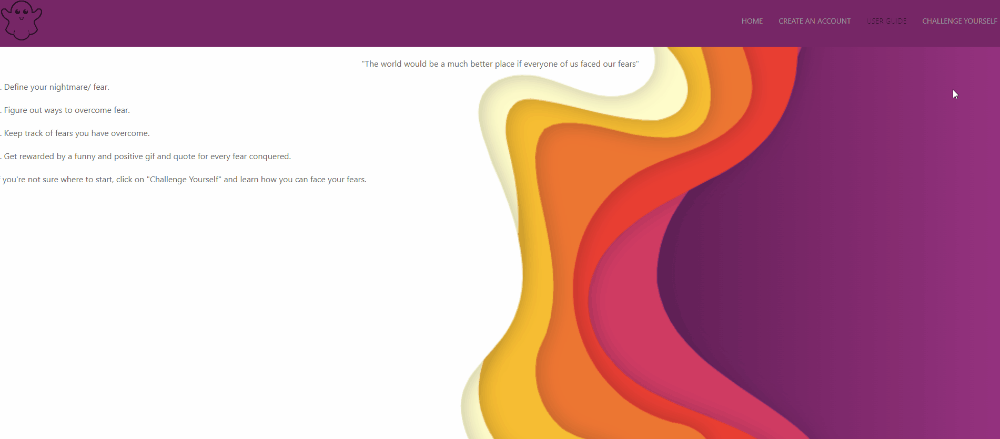

# Project-1_Fear-Setting

This is a project that integrates multiple server-side APIs and aims to solve a real world problem. Amidst the current pandemic there are a lot of individuals who are faced with daily fears. This application aims to create a safe space where an indvidual can face their fears and aim to overcome them. The application will reward the action of facing a fear by generating a positive quote and an entertaining Giphy when a fear task is completed. 

### Home Page

### Create User

### User Guide

### Challenge

## Project Presentation

[Project Presentation](https://docs.google.com/presentation/d/1jHOT-nh048uuWxn0Bx-Eeh37WNfCbdo3fWs7bjLh_Qo/edit?usp=sharing)

## Comprehension Check
Can you answer the following questions:
1. What is agile software development? 
Making small incremental changes & starting with MVP. 
2. What is an MVP? 
Minimum Viable Product. 
3. If you pull down a teammate's branch and you have merge conflicts, how do you handle it? 
You can assign someone to review the code directly on github or on your favorite editor (e.g. VS Code either allows you to accept or reject incoming changes from the merge).

## Learning Objectives

* Speak technically about a feature we implemented in our project
* Explain and execute git branching workflow in a collaborative project
* Resolve merge conflicts
* Explain agile software development
* Design, build, and deploy a client-side web application using GitHub Pages
* Prepare a professional presentation and repository README for your project

## API used 

* Giphy API
* Quote generator API 
* (IFTTT & Pushover for future use)
* Adorable Avatars API ( need to figure out storage and saving accounts)

## Frameworks 

UI KIT (an alternative to bootstrap) - this was chosen because of it's extensive documentation and the high quantitiy of features available. 

## Authors
1. Armenuhi Avanesyan 
2. Eric Purrington
3. Dan Weikart 

## Acknowledgements
1. UW Coding Bootcamp course activities
2. Slide Carnival - project presentations 
3. Colorinspo - color patterns 
4. ShareThis

## Design 
1. Image Color Picker - https://imagecolorpicker.com/en/
2. Volumnia -SlidesCarnival (used for design and slides)

## Documentation

* The URL of the deployed application - https://eric-purrington.github.io/Project-1_Fear-Setter/

* The URL of the GitHub repository  - https://github.com/eric-purrington/Project-1_Fear-Setter
